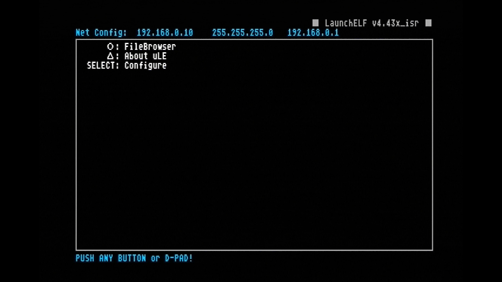
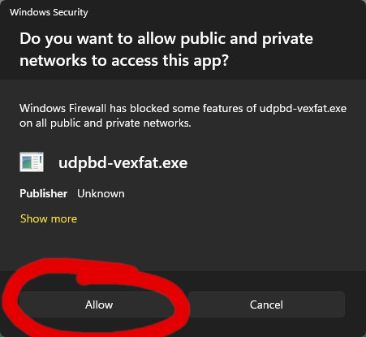

# Simple Neutrino Loader (SNL)

This is a PlayStation2 game loader that runs on the [Enceladus](https://github.com/DanielSant0s/Enceladus) Lua environment.  
SNL is a highly customizable interface that runs [neutrino](https://github.com/rickgaiser/neutrino).  
The full-install size (SNL, Enceladus, and all device drivers) is less than 1.4MB and can be installed on a memory card.  
The Lua interface code totals to less than 300 lines which makes mods easy.  
LaunchELF's text editor paired with a USB keyboard allows changes to be made from the PS2 itself.  
The included version of neutrino is modified to read files from the same directory avoiding the need for subfolders.  

## Controls:

Hold ↑UP or forward on the left analog stick to scroll up.  
Hold ↓DOWN or backwards on the left analog stick to scroll down.  
Press ❎CROSS, ⏺CIRCLE, or START to play the selected game.  
Press ⏹SQUARE or 🔼TRIANGLE to show what settings neutrino.elf will be passed.  
Hold SELECT to exit to browser.  


## UDPBD Setup:

The SNL-Manager application will automatically install Enceladus, SNL, and drivers for UDPBD gameplay.  
SNL-Manager is only compatible with [PS2BBL](https://github.com/israpps/PlayStation2-Basic-BootLoader) version 1.2.0 and newer.  
PS2BBL is needed to load network drivers on startup.  
For help installing PS2BBL please [watch my tutorial](https://www.youtube.com/watch?v=k1rYXCFaD9Q).  

To save 210KB of space SNL-Manager only includes drivers for UDPBD.  
For HDD, HDL, ILINK, MMCE, MX4, or USB use the SNL-Full release.  

Somewhere on your PC, for example Documents, create a new folder PS2.  
Inside the PS2 folder, create CD and DVD folders.  
Rip/copy any PlayStation 2 ISOs you wish to play into the DVD or CD folder.  
SNL-Manager can automatically convert Bin+Cue files to ISO if the box is checked then Synced.  
Download the latest release from this page (SNL-Manager).  
Extract the SNL-Manager folder to the Desktop or Documents.  
It is a portable app, do NOT use Program Files or any other system related folder.  
**DIRECT Connection** - Plug in the ethernet cable as shown: ↓  
  
For a **DIRECT** connection set a manual IPv4 address and subnet mask.  
  

**ROUTER Connection** - Plug in the ethernet cables as shown: ↓  
  
For a **ROUTER** connection, set the PC's IP assignment to *Automatic (DHCP)*.  
- On the PC go into network connections or run `ncpa.cpl`.  
- Right click the Ethernet adapter and select properties, then select IPv4 properties.  
- Enable "Obtain an IP address automatically".  

For a **ROUTER** connection the PS2 IP address settings for launchELF need to be changed.  
For the first IP address, the first three parts must match the default gateway of the router or switch.  
Example: 192.168.1.?  
The last part (?) needs to be a unique number between 2 and 254, example: `192.168.1.147`  
Set the middle number, subnet mask, to `255.255.255.0`  
The third IP address or default gateway, must match the default gateway of the router or switch.  
Most likely it will be `192.168.0.1` or `192.168.1.1`  
[View this guide](http://ps2ulaunchelf.pbworks.com/w/page/19520139/ps2ftp) for more info on how to set the IP address on the PS2.  

Make sure that the memory card has at least 1.2MB (1200KB) or more free.  
  
Open MISC -> PS2Net  
  
Let the PS2 idle on this screen for the next steps on the PC.  



### Windows Setup:

**If you plan to use virtual memory cards please read this:**  
Before syncing with SNL-Manager change vexfat to udpbd-server then check "use vmcs" then sync to the PS2.  
You must use udpbd-server when using VMCs, udpbd-vexfat does NOT support VMCs.  
AFAIK udpbd-server only works with exFAT partitions made with Linux/exfatprogs/GParted.  
The beginning of a [previous tutorial](https://www.youtube.com/watch?v=F6Ffg5DlKC4) shows how to do this.  

Rip/copy any PlayStation 2 disc images you wish to load into the folder that corresponds with their original source media.  
Example:  `%USERPROFILE%/Documents/PS2 Games/DVD/Grand Theft Auto III.iso`  

Start the SNL Manager app (SimpleNeutrinoLoaderGUI.exe).  
Type in the IP address and click Connect.  
  
Then click Install to PS2 and choose the target.  
  
Wait for the install to complete, this is what a successful install will show:  
  
Then select your game folder and Sync with PS2.  
  
Click Start Server and make sure to allow.  
  
If you miss clicked, either move the SNL-Manager folder inside a new folder or manually delete the inbound rules for udpbd-vexfat in 'Windows Defender Firewall with Advanced Security'.  
udpbd-vexfat is started as a separate process, SNL-Manager can be closed and the server will run in the background.  
The server needs to be open and running for the entire play session (Disable sleep on the PC).  
Now you are ready to play, run Enceladus or reboot the PS2.  
  

If you want the server to run automatically when the PC is starts follow these steps:  
- Create a shortcut to `udpbd-vexfat.exe`
- Right click the shortcut then select properties
- In the `Target` text box add a space the location of the DVD and CD folders in quotes.  
Here is an example:
```
"C:\Users\%USERNAME%\Documents\SNL-Manager\udpbd-vexfat.exe" "C:\Users\%USERNAME%\Documents\PS2 Games"
```
- Now test the shortcut and check if the server is able to find games.  
If the server exits immediately then there is most likely a typo in the shortcut's target.  
- Move the vexfat shortcut to this folder:  
`C:\Users\%USERNAME%\AppData\Roaming\Microsoft\Windows\Start Menu\Programs\Startup`  
Now the server will start automatically.  

### Linux Setup:

This guide uses ubuntu, if you are using a different distribution these steps may vary.  
Compile the udpbd-server  
```
sudo apt update
sudo apt upgrade
sudo apt install git build-essential
git clone https://gitlab.com/ps2max/udpbd-server.git
cd udpbd-server
make
```
Install .NET 8, GParted, and exfatprogs  
```
sudo apt install dotnet-runtime-8.0 gparted exfatprogs
```
Create a new exFAT partition in GParted and note the partition number.  
For this guide the exFAT partition is `/dev/nvme0n1p6`, it will be different on your system.  

Mount it to `/mnt/ps2`. Your storage device `/dev/nvme0n1p6` will probably be different.
```
sudo mkdir /mnt/ps2/
sudo mount /dev/nvme0n1p6 /mnt/ps2/ -o uid=$USER
```
Create folders named `CD` and `DVD` in the exFAT partition.  
Rip/copy any PlayStation 2 disc images you wish to load into the folder that corresponds with their original source media.  
Example:  `/mnt/ps2/DVD/Grand Theft Auto III.iso`  

Install Enceladus and SimpleNeutrinoLoader.  
The target install device must have 1.2MB or more free space.  
Please note the IP address settings and change the following commands accordingly.  
`dotnet SNL-CLI.dll -install mc0 -ps2ip 192.168.0.10 -boot`  
-install '?' will install Enceladus, neutrino, and SNL to the specified device (mc0, mc1, or mass).  
-ps2ip '?' is the ip address for connecting to the PS2 with PS2Net.  
-boot will modify basic-boot-loader to load network drivers on boot and auto-run SNL.  

Next sync the game list, note that 'enablevmc' is optional.  
`dotnet SNL-CLI.dll -path '/mnt/ps2' -ps2ip 192.168.0.10 -bin2iso -enablevmc`  
-path '?' is the file path to the CD and DVD folder that contain game ISOs.  
-bin2iso enables automatic CD-ROM Bin to ISO conversion.  
-enablevmc will assign a virtual memory card for each game or group of games in 'vmc_groups.list'.  

Unmount the exFAT partition then Start the udpbd-server.  
```
sudo umount /mnt/ps2
sudo ./udpbd-server /dev/nvme0n1p6
```
The server needs to be open and running for the entire play session.  
Now the setup is complete, run mc0:/Enceladus/enceladus_pkd.elf and Play!  

To add or rename/remove games, stop the server then mount the exFAT storage device to `/mnt/ps2`  
```
sudo mount /dev/nvme0n1p6 /mnt/ps2/ -o uid=$USER
```


## HDD, HDL, ILINK, MMCE, MX4, or USB Setup:

Download the latest release of SimpleNeutrinoLoader (SNL-Full-v1.0.0.0.zip).  
Extract then copy the Enceladus and SimpleNeutrinoLoader folders onto a PS2 memory card with LaunchELF.  
If using psuInstall, copy the psu files then psuPaste onto the memory card.  
The Enceladus and SimpleNeutrinoLoader folder should be placed in the root directory.  
 
In the root directory of the storage device, create CD and DVD folders.  
Rip/copy any PlayStation 2 ISOs you wish to play into the DVD or CD folder.  
Bin+Cue files must be converted to ISO.  
Please view the README from [XEB+ neutrino loader](https://github.com/sync-on-luma/xebplus-neutrino-loader-plugin) for info specific to the type of storage device you are using.  

Run SNL-ListBuilder.py with python to create a game list specific to your device.  
Alternatively an XEB+neutrino list can be converted to SNL with ListConvertXEBtoSNL.py  
Copy the list file (example: HDDList.txt) into the SimpleNeutrinoLoader folder on the PS2.  
Connect the game storage device to the PS2.  
Edit the configuration for PS2BBL:  
The text editor built into LaunchELF can do this.  
Replace the line LK_AUTO_E1 with this:  
`LK_AUTO_E1 = mc?:/Enceladus/enceladus_pkd.elf`  
or  
`LK_AUTO_E1 = mass:/Enceladus/enceladus_pkd.elf`  
This will set PS2BBL to auto-run SNL.  
LaunchELF can be accessed by holding R1 during PS2BBL startup.  


## SNL List File Editing

The following list files are checked on SNL startup:  
HDDList.txt, HDLList.txt, ILINKList.txt, MMCEList.txt, MX4List.txt, UDPBDList.txt, and USBList.txt.  
Here is an example of the list file contents:  
```
Katamari Damacy|SLUS_210.08|-bsd=udpbd|-dvd=mass:/DVD/Katamari Damacy.iso
LEGO Star Wars 2|SLUS_214.09|-bsd=udpbd|-dvd=mass:/DVD/LEGO Star Wars 2.iso
Midway Arcade Treasures 3|SLUS_210.94|-bsd=udpbd|-dvd=mass:/DVD/Midway Arcade Treasures 3.iso
```
Each line uses `|` as a separator for different parts.  
The first part is the name that will be visible on the SNL interface.  
The second part is the serial game ID found in SYSTEM.CNF.  
All further parts are command line arguments that will tell neutrino what settings to use for the selected game.  
There can be a variable number of parts, for example:  
`Katamari Damacy|SLUS_210.08|-bsd=udpbd|-dvd=mass:/DVD/Katamari Damacy.iso|-gc=23`  
The last part `-gc=23`, enables compatibility modes 2 and 3 when playing Katamari.  

Here is a list of all neutrino arguments:  

```
-bsd=<driver>     Backing store drivers, supported are:
                - no     (uses cdvd, default)
                - ata    (block device)
                - usb    (block device)
                - mx4sio (block device)
                - udpbd  (block device)
                - ilink  (block device)
                - mmce   (file system)

-bsdfs=<driver>   Backing store filesystem drivers used for block device, supported are:
                - exfat (default)
                - hdl   (HD Loader)
                - bd    (Block Device)
                NOTE: Used only for block devices (see -bsd)

-dvd=<mode>       DVD emulation mode, supported are:
                - no (default)
                - esr
                - <file>

-ata0=<mode>      ATA HDD 0 emulation mode, supported are:
                - no (default)
                - <file>
                NOTE: only both emulated, or both real.
                        mixing not possible
-ata0id=<mode>    ATA 0 HDD ID emulation mode, supported are:
                - no (default)
                - <file>
                NOTE: only supported if ata0 is present
-ata1=<mode>      See -ata0=<mode>

-mc0=<mode>       MC0 emulation mode, supported are:
                - no (default)
                - <file>
-mc1=<mode>       See -mc0=<mode>

-elf=<file>       ELF file to boot, supported are:
                - auto (elf file from cd/dvd) (default)
                - <file>

-mt=<type>        Select media type, supported are:
                - cd
                - dvd
                Defaults to cd for size<=650MiB, and dvd for size>650MiB

-gc=<compat>      Game compatibility modes, supported are:
                - 0: IOP: Fast reads (sceCdRead)
                - 1: dummy
                - 2: IOP: Sync reads (sceCdRead)
                - 3: EE : Unhook syscalls
                - 5: IOP: Emulate DVD-DL
                - 7: IOP: Fix game buffer overrun
                Multiple options possible, for example -gc=23

-gsm=x:y:z        GS video mode
                Parameter x = Interlaced field mode
                A full height buffer is used by the game for displaying. Force video output to:
                -      : don't force (default)  (480i/576i)
                - fp   : force progressive scan (480p/576p)

                Parameter y = Interlaced frame mode
                A half height buffer is used by the game for displaying. Force video output to:
                -      : don't force (default)  (480i/576i)
                - fp1  : force progressive scan (240p/288p)
                - fp2  : force progressive scan (480p/576p line doubling)

                Parameter z = Compatibility mode
                -      : no compatibility mode (default)
                - 1    : field flipping type 1 (GSM/OPL)
                - 2    : field flipping type 2
                - 3    : field flipping type 3

                Examples:
                -gsm=fp       - recommended mode
                -gsm=fp::1    - recommended mode, with compatibility 1
                -gsm=fp:fp2:2 - all parameters

-cwd=<path>       Change working directory
-cfg=<file>       Load extra user/game specific config file (without .toml extension)
-logo             Enable logo (adds rom0:PS2LOGO to arguments)
-qb               Quick-Boot directly into load environment
--b               Break, all following parameters are passed to the ELF
```


## Big Thanks to these Developers!  

Alex Parrado & Matías Israelson & Rick Gaiser - udpbd-server  
https://github.com/israpps/udpbd-server  

awaken1ng - udpbd-vexfat  
https://github.com/awaken1ng/udpbd-vexfat  

Damián Parrino - ps2vmc-tool  
https://github.com/bucanero/ps2vmc-tool  

Daniel Santos - Enceladus  
https://github.com/DanielSant0s/Enceladus  

Matías Israelson - PS2-Basic-Bootloader  
https://github.com/israpps/PlayStation2-Basic-BootLoader  

Rick Gaiser - neutrino  
https://github.com/rickgaiser/neutrino  

sync-on-luma - XEB+ neutrino Launcher Plugin  
https://github.com/sync-on-luma/xebplus-neutrino-loader-plugin  

